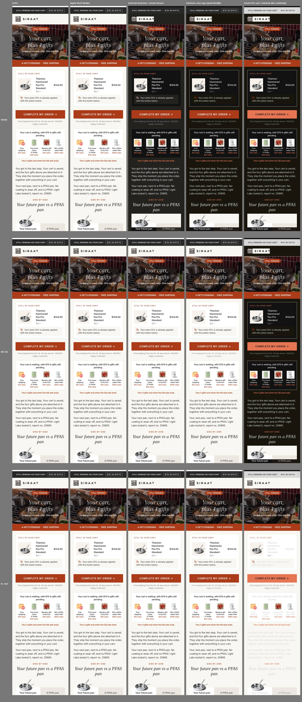
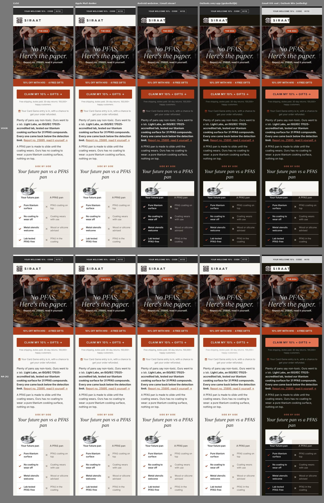
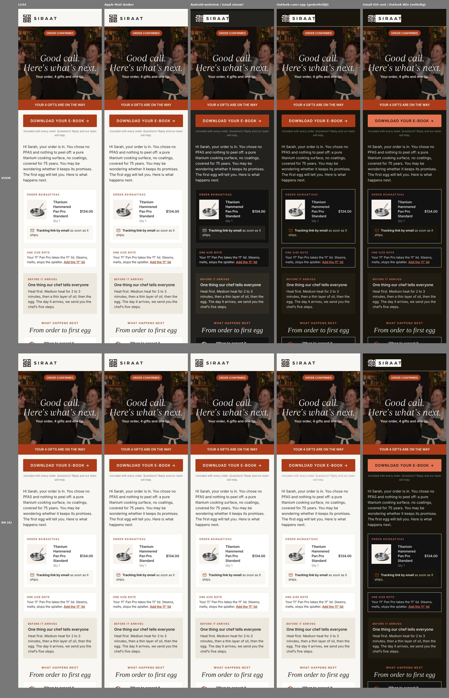

# 13 · Dark mode: kunnen de mails altijd hun eigen kleuren houden?

Stand: 8 oktober 2026, dark-mode-agent. Vraag van Floris: "In donkere modus gaat alles in reverse. Kunnen we zorgen dat de mails NIET donker worden? Wat is slim?" Alleen onderzocht en geprototypet op kopieën in `research/v6-golive/darkmode/`. Geen template, partial of script aangepast, niets naar Klaviyo.

## 1. Kort antwoord

- **Volledig afdwingen kan niet.** Een deel van de clients (Gmail-app iOS en Android tot voor kort, Outlook voor Windows, Outlook.com en de Outlook-apps, Yahoo-app, Samsung) beslist zelf of het kleuren omkeert. Er bestaat geen code die dat overal uitzet.
- **Wel veel winst met weinig risico:** we verklaren de mail officieel "alleen licht" (`light only`) in plaats van het huidige `light`. Dat volgen Apple Mail, Outlook voor Mac, Android-webviews die algoritmisch donker maken, en volgens een melding van september 2026 nu ook de Gmail-apps voor Gmail-accounts (nog niet bevestigd, zie 2.2). Met het huidige `light` gebeurt dat in die laatste groep **niet**: dat is de reden dat de mails nu omkeren.
- **Plus een herstelset voor Outlook.com en de Outlook-apps** (`[data-ogsb]`/`[data-ogsc]`-regels die de originele kleuren terugzetten), automatisch gegenereerd in `build_template.py`. Werkt in de simulatie; in een echte Outlook-inbox nog niet getest.
- **Niet doen:** crème vastzetten met `background-image: linear-gradient(...)` (de bekende Gmail-truc). In clients die volledig omkeren blijft de achtergrond dan crème, maar de tekst wordt wel licht: **lichte tekst op crème, onleesbaar** (variant B, zie screenshot). Ook geen blend-mode-trucs over hele mails.
- **Wat ondanks alles blijft omkeren:** Outlook voor Windows (Word-engine) en de Gmail-apps bij niet-Google-accounts (en Gmail iOS als de melding niet klopt). Daar ziet de mail eruit zoals nu: donker, maar leesbaar, met het logo op zijn eigen crème label.
- **Veilig vóór livegang?** De meta- en `:root`-wijziging: ja, nul effect in lichte modus, één regel in `build_template.py`. De Outlook-herstelset: pas na één echte testmail in Outlook.com/Outlook-app en Gmail (zie 6), anders na livegang.

## 2. Per client: wat kan wel en niet

Legenda: **ja** = de mail blijft licht met `light only`; **deels** = met extra code grotendeels te sturen; **nee** = client keert zelf om, niet uit te zetten. Zekerheid: **zeker** (meerdere onafhankelijke bronnen of eigen meting), **waarschijnlijk** (bronnen eens, niet zelf gezien), **onzeker** (bronnen spreken elkaar tegen of één bron).

| Client | Wat hij in dark mode doet | Volgt `light only`? | Wat wij kunnen | Zekerheid |
|---|---|---|---|---|
| Apple Mail iOS en macOS | Geen eigen kleurwijziging als de mail `color-scheme` meldt; zonder melding maakt hij "eenvoudige" mails zelf donker. Volgt `prefers-color-scheme`. | **ja** (doet het nu al met `light`) | Niets extra nodig | zeker |
| Outlook voor Mac | Als Apple Mail, volgt `prefers-color-scheme` | **ja** | Niets extra | waarschijnlijk |
| Gmail web (browser) | Verandert de mail niet, ook niet in donker thema | **ja** (n.v.t.) | Niets | zeker |
| Gmail-app iOS | Tot nu toe volledige inversie, negeert meta en media queries. Sinds sept 2026 gemeld (Mark Robbins, via Email Mavlers) dat `light only` gevolgd wordt, **alleen bij Google-accounts**; bij Gmailify/andere accounts haalt Gmail de meta weg | **deels** (nieuw, onbevestigd) | `light only`. Als dat niet werkt: alleen per element de blend-mode-truc, niet zinvol voor hele mails | onzeker |
| Gmail-app Android | Tot nu toe gedeeltelijke tot volledige inversie (bronnen verschillen). Zelfde melding sept 2026 | **deels** (nieuw, onbevestigd) | `light only` | onzeker |
| Outlook.com en nieuwe Outlook voor Windows | Gedeeltelijke inversie: lichte vlakken donker, donkere tekst licht, gekleurde vlakken blijven. Meta wordt volgens Microsoft Q&A niet als opt-out gevolgd. Zet `data-ogsc`/`data-ogsb` op elementen die het omzet. Lezer kan per mail het zonnetje aanklikken | **nee**, maar **deels** te sturen | `[data-ogsb] .klasse{...!important}`-regels zetten originele kleuren terug | waarschijnlijk (mechanisme), onzeker (of het al onze kleuren dekt) |
| Outlook-app iOS en Android | Gedeeltelijke inversie, zelfde attributen als Outlook.com | **nee**, **deels** te sturen | Zelfde `[data-og*]`-regels (bevestigd voor beeldwissels in Outlook Android en iPhone) | onzeker |
| Outlook Windows klassiek (Word) | Volledige inversie in donker thema, geen media queries, geen attribuutselectoren | **nee** | Alleen mso-trucs per element (`mso-style-textfill-type:gradient`, `mso-color-alt`). Niet de moeite: ca. 2 procent van onze lezers (01-inbox-check) | zeker |
| Yahoo / AOL | Web: nauwelijks wijziging. Apps: gedeeltelijke inversie, geen `prefers-color-scheme` | **nee** | Niets betrouwbaars | onzeker |
| Samsung Mail | Eigen gedeeltelijke inversie, gedrag verschilt per One UI-versie; ondersteunt `prefers-color-scheme` | **deels**? | `light only` helpt mogelijk (webview), niet bevestigd | onzeker |

Aandeel bij ons (uit `research/deliverability/01-inbox-check.md`): Hotmail/Outlook.com is 12,5 procent van de mail en 63 procent van de klachten; Outlook Windows ongeveer 2 procent. Gmail is de grootste groep.

### 2.1 Waarom `light` niet genoeg is en `light only` wel

Volgens de CSS-specificatie betekent `color-scheme: light` "deze pagina ondersteunt licht"; een browser of app mag dan nog steeds zelf donker maken (forced/auto dark). Alleen het sleutelwoord `only` (`light only` of `only light`, beide geldig) verbiedt dat. Eigen meting in Chromium (de engine achter Android-webviews en dus Gmail Android en Samsung): de huidige mails worden met `light` volledig donker gemaakt, met `light only` blijven ze licht (kolom 3 in de screenshots).

### 2.2 Over de Gmail-melding van september 2026

Eén secundaire bron (Email Mavlers, "Gmail Dark Mode for HTML Email: The New Light-Only Approach") meldt dat Mark Robbins vond dat de Gmail-apps op iOS en Android nu een light-only-verklaring volgen, voor Google-accounts. Andere, oudere tabellen (Litmus, Email on Acid) noemen Gmail iOS nog volledige inversie. Ik heb het origineel niet kunnen lezen (caniemail, Litmus en hteumeuleu zijn vanuit deze omgeving geblokkeerd). **Dit moet met een echte testmail op een telefoon bevestigd worden** (zie 6). Kost niets en is het belangrijkste onbekende.

## 3. Technieken beoordeeld

| Techniek | Werkt in | Risico | Advies |
|---|---|---|---|
| `<meta name="color-scheme" content="light only">` + `supported-color-schemes` + `:root{color-scheme:light only}` | Apple Mail, Outlook Mac, Chromium/Android-webviews, Gmail-apps (gemeld) | Geen: in lichte modus verandert niets | **Doen, vóór livegang** |
| `[data-ogsb]`/`[data-ogsc]`-herstelregels per kleur, automatisch gegenereerd | Outlook.com, nieuwe Outlook Windows, Outlook-apps | Klein: +2 KB per mail; Gmail kan een `<style>` met attribuutselectoren weggooien, daarom een eigen blok | **Doen na één echte Outlook-test** |
| Logo op eigen vast vlak (geplat PNG) | Overal | Geen | **Al gedaan**: `logo-black-cream.png` (header) en `logo-white-dark.png` (footer). In donker wordt het een crème label, maar altijd leesbaar |
| Donkere iconen op transparant (o.a. `icon-discount-tag.png`, `icon-check/cross.png`) platten op hun achtergrondkleur | Overal | Geen | **Doen** (klein, kan later): nu 3,0:1 in inversie |
| Productfoto's en gift-beelden met wit vlak | Overal | Geen | Laten zo: in donker een witte tegel, dat is acceptabel en eerlijker dan een uitgeknipte pan |
| Achtergrond vastzetten met `background-image: linear-gradient(#F8F7F2,#F8F7F2)` | Gmail-apps, Outlook laten background-image staan | **Groot**: tekst wordt wel omgekeerd, dus lichte tekst op crème (variant B hieronder) | **Niet doen** |
| Gmail blend-mode-truc (`u + .body` met `mix-blend-mode: screen/difference`) | Gmail iOS (oud gedrag) | Per element, breekbaar, alleen voor witte tekst op kleur | Niet doen. Overbodig als Gmail `light only` volgt; terracotta balken en knoppen blijven in inversie leesbaar (zalm met donkere tekst) |
| mso-trucs voor Outlook Windows | Outlook Windows | Veel werk per element, 2 procent van de lezers | Niet doen |
| Eigen donkere variant (`light dark` + `@media (prefers-color-scheme: dark)`) | Apple, Outlook.com/-apps, Samsung | Tweede ontwerp onderhouden over 61 mails; Gmail-apps en Outlook Windows doen toch hun eigen ding | Niet nu; eventueel later voor Apple-lezers |

## 4. Wat doen marktleiders en ervaren e-maildesigners?

- **Vakpers (Litmus, Email on Acid, Campaign Monitor, Parcel):** het algemene advies is "omarm dark mode": `light dark` verklaren en een eigen donkere stijl leveren, en je ontwerp zo maken dat het een omkering overleeft. `light only` wordt genoemd als legitiem, maar met de waarschuwing dat het "minder ondersteund" is. Dat beeld draait nu iets door de Gmail-melding.
- **Wat merken in onze categorie echt doen** (broncode via Email Love, mails van sept/okt 2026): Our Place (crème en warm bruin, net als wij), Zwilling, GreenPan en Le Creuset hebben **geen enkele** `color-scheme`-verklaring, geen `prefers-color-scheme` en geen `[data-og*]`-regels. Le Creuset en GreenPan zijn bijna volledig beeld (tekst in de afbeelding), wat in de praktijk hun "dark-mode-oplossing" is: beelden worden nergens omgekeerd. Kanttekening: Email Love levert opgeschoonde HTML; Zwilling's head-metas staan er nog wel in, dus het ontbreken is waarschijnlijk echt.
- **Conclusie voor Siraat:** een eigen donkere variant is voor een merk met crème, terracotta en sfeerfoto's veel werk voor weinig: in donker zou het eruit moeten zien als een ander merk. "Licht verklaren, en wat toch omkeert robuust maken" past beter bij ons en is ook wat de vergelijkbare merken in feite doen. Tekst-als-beeld zoals Le Creuset raad ik af (deliverability, toegankelijkheid, en we hebben net veel live tekst opgebouwd).

## 5. Prototype en screenshots

Werkwijze (alles in `research/v6-golive/darkmode/`):

1. `before/` : c1 (event co_pan), w1-a en p1-first gerenderd via de qa_render-route (build_template + Django op het testevent), stand vanavond.
2. `make_after.py` : maakt `after/` met precies de voorgestelde build-stap (`light_only()`), plus `after/c1-B.html` met de gradient-truc ter vergelijking.
3. `sim_shots.js` : screenshots op 375 px in vijf weergaven:
   - **Licht**.
   - **Apple Mail donker**: `prefers-color-scheme: dark`.
   - **Android-webview / Gmail nieuw?**: Chromium auto-dark (`WebContentsForceDark`). Volgt `only light`, zoals Gmail volgens de melding nu doet.
   - **Outlook.com/-app (gedeeltelijk)**: eigen simulatie die de client nadoet: lichte vlakken en donkere tekst omgekeerd (HSL-lichtheid, begrensd op 7 en 93 procent), beelden en background-image ongemoeid, `data-ogsb`/`data-ogsc` op wat omgezet is. Negeert `color-scheme`.
   - **Gmail iOS oud / Outlook Windows (volledig)**: alle kleuren omgekeerd, body omgebouwd naar `<u></u><div class="body">` zoals Gmail, geen `[data-og*]`. Negeert `color-scheme`.
4. `compare.py` : vergelijkingsbeelden (bovenste 1500 px). Losse screenshots (volledige lengte) in `darkmode/shots/`.

Opnieuw draaien: `cd /tmp && python3 -I <repo>/research/v6-golive/darkmode/make_after.py && PLAYWRIGHT_BROWSERS_PATH=/opt/pw-browsers node <repo>/research/v6-golive/darkmode/sim_shots.js && python3 -I <repo>/research/v6-golive/darkmode/compare.py` (de before-bestanden zijn een momentopname; een andere agent past de templates nu aan).

**C1** (rij 1 voor, rij 2 na, rij 3 variant B die we niet moeten doen):



**W1-A** en **P1-first** (voor / na):





Wat de beelden laten zien:

| Weergave | Voor | Na (A) |
|---|---|---|
| Licht | goed | identiek (pixelgelijk op het oog; alleen klassen en een extra `<style>` erbij) |
| Apple Mail donker | blijft licht (we hebben al `light`) | blijft licht |
| Android-webview / Gmail nieuw | **helemaal donker** (Chromium negeert `light`) | **blijft licht** |
| Outlook.com/-app | crème wordt bijna zwart, tekst licht, logo als crème label | blijft licht in de simulatie, behalve de witte rand buiten de 600 px op desktop (buitenste wrapper heeft geen voorouder met `data-ogsb`) |
| Gmail iOS oud / Outlook Windows | volledig omgekeerd, leesbaar | **ongewijzigd** volledig omgekeerd: hier helpt niets |
| Variant B, volledig | | crème blijft, tekst wordt lichtgrijs: **onleesbaar** |

Beperking: kolommen 4 en 5 zijn simulaties van het gedrag, geen echte clients. Ze laten zien dat het mechanisme klopt, niet dat Outlook.com elke regel overneemt.

## 6. Wat nog moet gebeuren (en hoe we het zeker weten)

1. **Echte test, 10 minuten, vóór of direct na livegang:** één testmail (bv. C1 als preview-send) met de nieuwe build naar `lolagroothuis+dm@gmail.com` en naar een Outlook.com/Hotmail-adres. Telefoon in donkere modus, openen in: Gmail-app iPhone, Gmail-app Android, Outlook-app, Apple Mail, outlook.com in de browser met donker thema. Foto maken. Dan weten we of Gmail `light only` volgt en of de Outlook-regels pakken.
2. **QA-scripts bijwerken** (anders worden ze misleidend): `scripts/qa_mail_shots.js` gebruikt voor "geforceerd donker" Chromium auto-dark, en die volgt `light only`. Na deze wijziging toont die modus dus altijd licht, ook als Gmail of Outlook toch omkeert. Voorstel: de modus `forced` vervangen door de JS-simulaties `partial` en `full` uit `darkmode/sim_shots.js` (functie `sim`), en `algo` als extra modus houden.
3. Kleine iconen platten (zie 3), kan na livegang.

## 7. Code-wijzigingen (diff-voorstel, niet toegepast)

Alles centraal in `scripts/build_template.py`; de 61 bron-templates en de partials hoeven niet aangepast. De bronnen houden `content="light"`, de build maakt er `light only` van. Ook de lokale preview krijgt het, zodat QA hetzelfde ziet.

```diff
--- a/scripts/build_template.py
+++ b/scripts/build_template.py
@@ def head_fix(x):
     return x.replace('</head>',MSO+'</head>',1)
 k=head_fix(k)
+# Dark mode (research/v6-golive/13-darkmode.md, 8 okt 2026): mail is alleen licht.
+# 1. 'light only' i.p.v. 'light': Apple Mail, Outlook Mac, Android-webviews en (gemeld sept 2026) Gmail-apps keren dan niet om.
+# 2. Outlook.com/Outlook-apps keren toch om en zetten data-ogsb/data-ogsc; per gebruikte kleur een herstelregel.
+#    Eigen <style>-blokken: een client die :root of attribuutselectoren niet snapt, gooit alleen dat blok weg.
+def light_only(x):
+    x=re.sub(r'<meta name="color-scheme" content="[^"]*">','<meta name="color-scheme" content="light only">',x)
+    x=re.sub(r'<meta name="supported-color-schemes" content="[^"]*">','<meta name="supported-color-schemes" content="light only">',x)
+    ub,uc=set(),set()
+    def tag(m):
+        t=m.group(0); st=re.search(r'style="([^"]*)"',t); sv=st.group(1) if st else ''
+        b=re.search(r'(?:^|;)\s*background(?:-color)?\s*:\s*(#[0-9A-Fa-f]{6})\b',sv) or re.search(r'\bbgcolor="(#[0-9A-Fa-f]{6})"',t)
+        c=re.search(r'(?:^|;)\s*color\s*:\s*(#[0-9A-Fa-f]{6})\b',sv)
+        cls=[]
+        if b: cls.append('ob-'+b.group(1)[1:].lower()); ub.add(b.group(1).upper())
+        if c: cls.append('oc-'+c.group(1)[1:].lower()); uc.add(c.group(1).upper())
+        if not cls: return t
+        if re.search(r'\sclass="',t): return re.sub(r'\sclass="([^"]*)"',lambda y:' class="%s %s"'%(y.group(1),' '.join(cls)),t,count=1)
+        return re.sub(r'^<(\w+)',lambda y:'<%s class="%s"'%(y.group(1),' '.join(cls)),t,count=1)
+    head,body=x.split('<body',1)
+    body=re.sub(r'<(?:td|th|table|tr|div|p|span|a|b|strong|i|em|h\d|font)\b[^>]*>',tag,body)
+    rules=['[data-ogsb] .ob-%s{background-color:%s!important;}'%(v[1:].lower(),v) for v in sorted(ub)]
+    rules+=['[data-ogsb] .oc-%s,[data-ogsc] .oc-%s{color:%s!important;}'%(v[1:].lower(),v[1:].lower(),v) for v in sorted(uc)]
+    head=head.replace('</head>','<style>:root{color-scheme:light only;}</style>\n<style>\n%s\n</style>\n</head>'%'\n'.join(rules),1)
+    return head+'<body'+body
+k=light_only(k)
 k=re.sub(r'<!--(?![\[<>]).*?-->\n?','',k,flags=re.S)
@@
 p=h.replace('{{IMG}}',os.path.basename(assets.rstrip('/'))).replace('{{SHARED}}',os.path.relpath(SH,os.path.dirname(os.path.abspath(src))))
+p=light_only(p)
```

Stapsgewijs inbouwen kan ook: eerst alleen de twee `re.sub`-regels voor de meta's plus het `:root`-blok (stap 1, nul risico), de klassen en `[data-og*]`-regels pas na de echte Outlook-test (stap 2). De echte implementatie staat werkend in `darkmode/make_after.py` (functie `light_only`).

Aandachtspunten bij inbouwen:

- **Grootte:** +2,3 KB per mail (c1 31,7 naar 34,0 KB ruw). Grootste mail blijft ruim onder de Gmail-grens van 102 KB (nu max ongeveer 52 KB geschat verzonden).
- **Django-tags in `style` of `class`:** de regex raakt alleen letterlijke `#xxxxxx`-kleuren in `style=` en `bgcolor=`, niet ``-uitdrukkingen. Na inbouwen `qa_render.py` (alle markten) en `check_previews.py` draaien; mail_checks controle 11 (header/footer, logo byte-gelijk) blijft geldig.
- **Klaviyo:** controleren in één preview-send of Klaviyo beide extra `<style>`-blokken laat staan (code-templates worden normaal niet ge-inlined, maar niet zelf getest).
- **PLAYBOOK:** regel toevoegen bij h12 (techniek): "Alle mails `color-scheme: light only`; geen eigen dark-mode-ontwerp. Beelden met tekst of logo altijd op een eigen vast vlak, nooit donker op transparant."

## 8. Bronnen

- Rémi Parmentier (hteumeuleu), "Fixing Gmail's dark mode issues with CSS Blend Modes" (2021) en CodePen "Making Emails React to Outlook.com's Dark Mode": blend-mode-truc en `[data-ogsb]`. https://www.hteumeuleu.com/2021/fixing-gmail-dark-mode-css-blend-modes/ , https://codepen.io/hteumeuleu/pen/ZEBrJbp
- Smashing Conference 2022, Parmentier, "Shining the light on HTML Emails Dark Modes": in Gmail dark mode verandert alleen background-color, niet background-image. https://noti.st/hteumeuleu/QhIGkB/slides
- matthieuSolente/email-darkmode (GitHub): overzicht technieken per client (blend modes Gmail iOS, `[data-ogsc]` Outlook Android/iOS, mso-trucs Outlook Windows). https://github.com/matthieuSolente/email-darkmode
- Email Mavlers, "Gmail Dark Mode for HTML Email: The New Light-Only Approach" (sept 2026, melding Mark Robbins, alleen Google-accounts). https://emailmavlers.com/blog/gmail-dark-mode-html-email/
- Microsoft Q&A, "How can I prevent Outlook from overriding background and text colors in dark mode?": meta `light only` voorkomt omkering in Outlook niet. https://learn.microsoft.com/en-us/answers/questions/4756669/
- Microsoft Tech Community, "Windows Outlook prefers-color-scheme": werkt niet in Outlook Windows, wel op Mac en web. https://techcommunity.microsoft.com/discussions/outlookgeneral/windows-outlook-prefers-color-scheme/3915925
- Email on Acid, "Master the Art of Dark Mode Email Design and Coding"; Litmus, "Ultimate Guide to Dark Mode"; Campaign Monitor, "The Developer's Guide to Dark Mode in Email"; Parcel, "Guide to color scheme in email" (`only light` minder ondersteund, advies `light dark`). (via zoekresultaten; de sites zelf zijn vanuit deze omgeving geblokkeerd)
- MDN, `color-scheme`: `only` verbiedt de user agent een ander schema te forceren.
- Email Love (broncode): Our Place "Which One Are You?" (26 sep 2026), Zwilling "The complete cookware set, now on sale" (30 sep), GreenPan "SAVE UP TO 60%" (3 okt), Le Creuset "Signature 9-Piece Cookware Set" (22 sep).
- Eigen eerdere metingen: `research/deliverability/01-inbox-check.md` (sectie 3), `research/v6-golive/04-inbox-qa.md`.

Niet gelukt: caniemail.com, litmus.com, hteumeuleu.com, emailonacid.com en dev.to zijn vanuit deze cloudomgeving geblokkeerd (egress-proxy). De tabel in 2 leunt daarom op zoekresultaten, GitHub-bronnen en eigen Chromium-metingen; de onzekere regels zijn als zodanig gemarkeerd.
