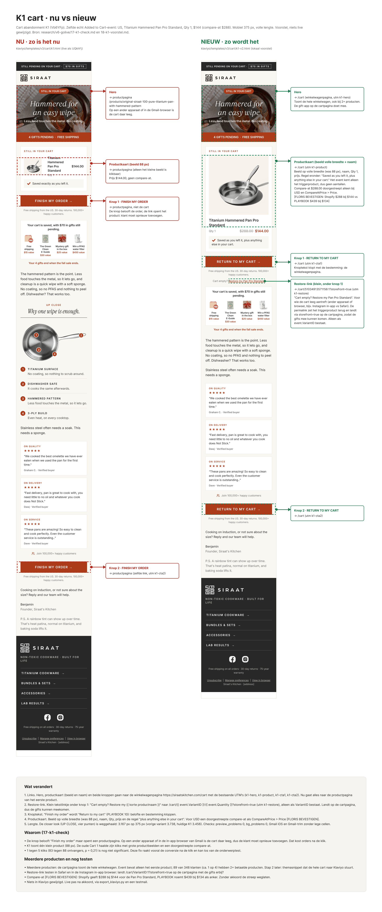

# 18 · K1 cart: voorstel links naar de winkelwagenpagina en grotere productkaart

Datum: 10 okt 2026. Vervolg op `17-k1-check.md`. Alleen lokaal gebouwd en gerenderd, niets in Klaviyo gewijzigd (geen API-writes, geen uploads, geen sends).

**Herzien 10 okt (middag).** De eerste variant linkte naar de cart-permalink `/cart/{VariantID}:{Quantity}`. Afgekeurd: het Added to Cart-event bevat alleen het triggerproduct, ongeveer 1 op 4 klanten heeft 2+ betaalde producten in de cart (89 van 348) en de permalink zou die laten wegvallen; bovendien slaat hij de gift-app op de cartpagina over. Keuze Floris: "de knop gaat naar de winkelwagenpagina".

**Figma:** https://www.figma.com/design/ahGP2wWoVIif8ETXcBq1Dj?node-id=79-2 (bestand Flow System v4, pagina "K1 cart · nu vs nieuw (10 okt)", frame "K1 vergelijking" 79:3).
Screenshot van de Figma-pagina: `img/18-k1-figma.png`.

## Bestanden

- Bron nieuw: `klaviyo/templates/v3/cart/k1-v2.html`, gebouwd met `build_template.py` naar `k1-v2.klaviyo.html` en `k1-v2-preview.html`. Huidig: `k1.html` (live als UQkhFj), ongewijzigd.
- Screenshots (echt Added to Cart-event, US, Titanium Hammered Pan Pro Standard, Qty 1, Price 144, CompareAtPrice 288, VariantID 51034913571156; voornaam "Alex", geen klantgegevens):
  - nu: `img/18-k1-nu-375.jpg` (mobiel, volle lengte), `img/18-k1-nu-600.jpg`
  - nieuw: `img/18-k1-nieuw-375.jpg`, `img/18-k1-nieuw-600.jpg`, `img/18-k1-nieuw-gmailios.jpg`

## A. Linkwijzigingen per element

| Element | Nu | Nieuw |
|---|---|---|
| Hero (utm k1-hero) | productpagina uit `event.URL`; op een ander apparaat of in een in-app browser is de cart daar leeg | `https://siraatskitchen.com/cart`: de winkelwagenpagina met de hele cart en de gift-app |
| Productkaart (utm k1-product) | alleen het beeld van 88 px, naar de productpagina | beeld op volle breedte en productnaam, naar `/cart` |
| Knop 1 (utm k1-cta1) | "Finish my order" naar de productpagina | "Return to my cart" naar `/cart` |
| Restore-link (utm k1-restore, nieuw) | bestaat niet | klein linkje onder knop 1: "Cart empty? Restore my {{ korte productnaam }}" naar `/cart/{{ event.VariantID }}:{{ event.Quantity }}?storefront=true`, alleen als `event.VariantID` bestaat |
| Knop 2 (utm k1-cta2) | "Finish my order" naar de productpagina | "Return to my cart" naar `/cart` |
| Header, nav, footer | ongewijzigd | ongewijzigd |

Alle links: `?utm_source=klaviyo&utm_medium=email&utm_campaign=v4-cart&utm_content=k1-<blok>`.

**Restore-link.** Voor wie de cart leeg aantreft omdat de mail in een andere browser opent dan waar de cart werd gevuld (bijv. Instagram in-app browser tegenover Safari, of een ander apparaat). De permalink zet het triggerproduct terug; `?storefront=true` laat Shopify op de cartpagina landen in plaats van direct in de checkout, zodat de gift-app de gifts kan toevoegen. Korte naam: `Product Name` met `cut:'Titanium '|cut:'Hammered '` ("Restore my Pan Pro Standard"). `cut` staat in qa_render als TWIJFEL (Django-filter, in Klaviyo niet zelf bevestigd; de live K1 gebruikt hem al op `event.URL`).

Gecontroleerd op vier renders: echt US-event (alles `/cart`, restore-link met `51034913571156:1?storefront=true`), zonder VariantID (geen restore-link), EUR/NL (geen prijs, restore-link wel), leeg event (placeholderbeeld, `/cart`, geen restore-link).

## Knopteksten

- Beide knoppen: **Return to my cart** (PLAYBOOK 10: in checkout en cart "Return to my cart"; ik-vorm volgens de skill siraat-direct-response). De knop opent de winkelwagen, dus belofte en bestemming kloppen.
- Friction reducer onder beide knoppen ongewijzigd: `{{FRICTION}}` (US: `Free shipping from the US. 30-day returns. 100,000+ happy customers.`).

## B. Productkaart

- Beeld op volle breedte (478 px desktop, ca. 297 px op 375 px, Shopify-beeld met `&width=1000`), was 88 px. Fallbackbeeld (264 px) blijft op eigen maat.
- Productnaam 18 px (klikbaar), `Qty 1` links, prijs rechts.
- Regel onder de prijs: "Saved as you left it, plus anything else in your cart." Eerlijk bij 1 en bij meer producten; geen aantallen, want het event kent alleen het triggerproduct.
- Prijs alleen bij USD (`{{IF:US}}` plus `$currency == 'USD'`, zoals nu). Compare-at doorgestreept alleen als `event.CompareAtPrice > event.Price`: in het voorbeeld ~~$288.00~~ $144.00.
- **[VRAAG FLORIS] compare-at bevestigen.** Shopify geeft nu $288 bij $144 voor de Pan Pro Standard; PLAYBOOK 12 noemt $439 bij $134 als bevestigd anker en zegt dat andere maten geen bevestigde compare-at hebben. Zonder akkoord de compare-at-regel weglaten. Annotatie staat ook als commentaar in de bron.

## C. Lengte

- Weggehaald: de **closer look** voor de Pan Pro ("UP CLOSE / Why one wipe is enough.", panpro-beeld met vier genummerde punten). Het grote productbeeld toont de pan al; de verhaalstap (hammered pattern, easy wipe) staat nog in de hero, de lopende tekst en de RVS-zin.
- Lengte op 375 px (echt event): nu 3.456 px, vorige variant 3.738 px, **nieuw 3.167 px** (richtlijn 3.600). 600 px: 3.180 px. Andere pannen en sets houden de RVS-vergelijking (`BLOCK:vs kind="steel"`); die zijn niet opnieuw gemeten.

## Checks

- `mail_checks.preview_problems` en `bg_problems`: 0 op de ruwe HTML en op alle vier renders. `qa_render.after_render`: 0.
- `qa_mail_shots.js` op 375 px: light, apple, gmailios, gmailtrim (plus 600 light): geen overflow (scrollWidth = viewport), geen afgesneden of kapotte beelden, geen lege cellen, geen lage contrasten. Gmail iOS schaalt in tot 84 procent, net als nu.
- Geen gedachtestreepje, geen kortingscode.

## Nog testen voor livegang

1. **Meerdere producten.** De cartpagina toont de hele winkelwagen. Het event bevat alleen het eerste product; 89 van 348 klanten (ca. 1 op 4) hebben 2+ betaalde producten. Stap 2 later: een themasnippet dat de hele cart naar Klaviyo stuurt, zodat de mail alle producten kan tonen.
2. **Restore-link.** In Safari en in de Instagram in-app browser testen: landt `/cart/<VariantID>:1?storefront=true` op de cartpagina, en voegt de gift-app de gifts toe?
3. **Compare-at** door Floris laten bevestigen (zie B).
4. **`cut`-filter** één keer in een Klaviyo-preview bevestigen (korte productnaam in de restore-link).
5. Daarna pas export via `export_klaviyo.py` (dry-run, dan live) en een testmail met een uniek onderwerp.
